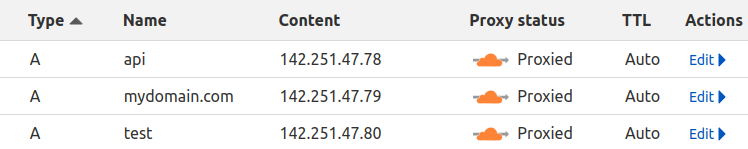

# A Python script for patching a Cloudflare's DNS record.

If you are using Cloudflare as CDN or proxy to a server with no reserved IP address from a cloud provider, you could use this script to run when switched on to update your records as desired.

Say you have the following records on Cloudflare:


The `test` server is frequently switched on and off and its IP address changes every time it is started. Running this script by passsing it the ID of the record and the content to use as new records in a Python dictionary-like string will update the specified record.

## How to use it
### Prerequisites
- Make sure you have `wget` or similar tool installed
- Have Python 3 installed
- Add your Cloudflare configurations to your environment variables as follows:
```bash
export CLOUDFLARE_AUTH_EMAIL="Cloudflare account email"
export CLOUDFLARE_AUTH_KEY="Cloudflare API Key"
export CLOUDFLARE_ZONE_ID="Your zone ID"
```

### Running the script


```bash
wget -O - https://raw.githubusercontent.com/Olfredos6/cloudflary.py/main/cloudflary.py | python3 - DNS_RECORD_IDENTIFIER "PYTHON_DICTIONARY_STRING"
```

Command args:
- DNS_RECORD_IDENTIFIER: the ID of the record you wish to patch e.g: 8ec292220081262ca459013e40f80df5
- PYTHON_DICTIONARY_STRING: the dictinnary-like python string to serve as payload. e.g: `{"content": "13.246.32.197"}`


### Example
```bash
wget -O - https://raw.githubusercontent.com/Olfredos6/cloudflary.py/main/cloudflary.py |python3 - 8ec292220081262ca459013e40f80df5 '{"content": "142.251.47.78"}'
```

> 142.251.47.78 is Google :sweat_smile:
